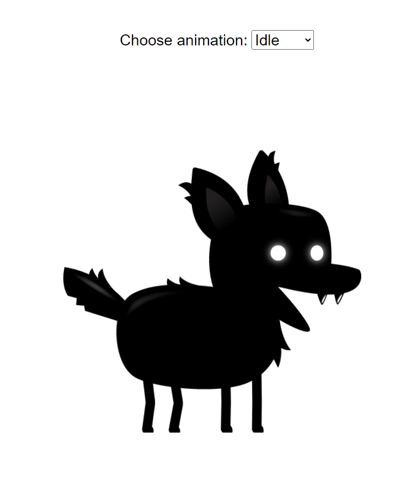
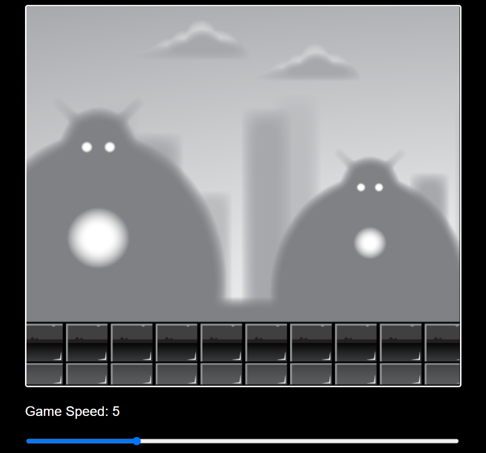
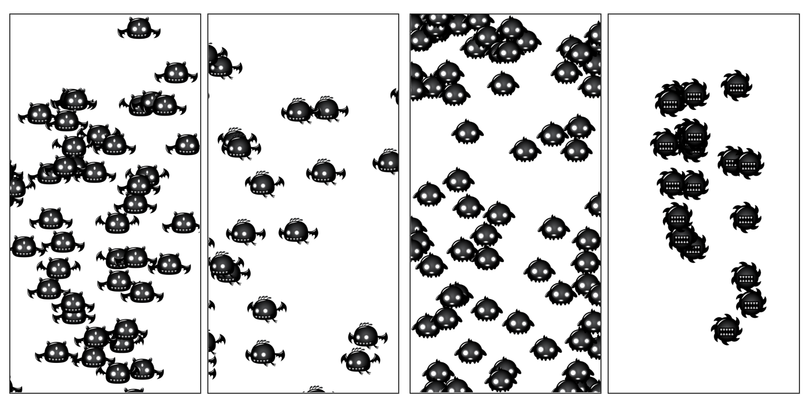
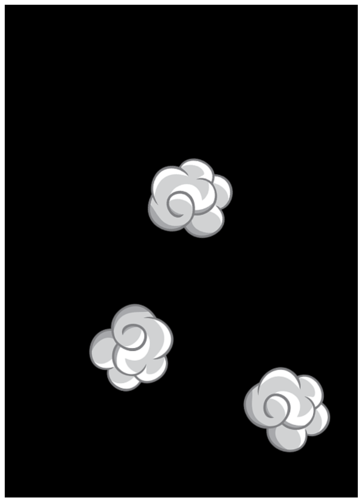

# JavaScript Game Development Course for Beginners

These are the projects from the [JavaScript Game Development Course for Beginners](https://www.youtube.com/watch?v=GFO_txvwK_c) by freeCodeCamp.

## Built with 🛠️

- [HTML5](https://developer.mozilla.org/en-US/docs/Web/Guide/HTML/HTML5) - Markup language
- [CSS3](https://developer.mozilla.org/en-US/docs/Web/CSS) - Stylesheet language
- [JavaScript](https://developer.mozilla.org/en-US/docs/Web/JavaScript) - Lightweight programming language

## Previews 👁️

- Vanilla JavaScript sprite animation

- Parallax backgrounds with JavaScript

- Enemy movement patterns

- Collision animation from a sprite sheet

- Point & shoot game

<video src="point-and-shoot-game/assets/preview.mp4" controls></video>

## Requirements ⚙️

A text editor like [Visual Studio Code](https://code.visualstudio.com/) and a development local server such as [Live Server](https://marketplace.visualstudio.com/items?itemName=ritwickdey.LiveServer).
